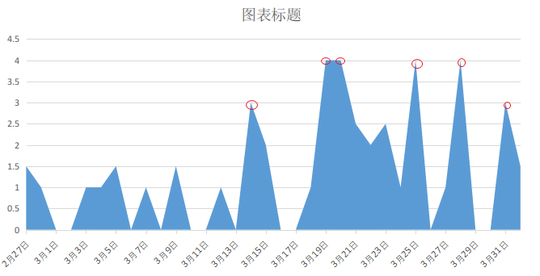

# PROJECT A

> 课程总时长：17小时
>
> 项目花费总时长：45小时（2.6倍）
>
> 总天数：34天
> 实际学习天数：22天，休息天数12天
> 实际平均每天：1.3小时，实际平均每天（除休息外）：2小时
>
> 总结：
> 相对来说学习时间极不规律（见下图）。前期明显水垮垮的，后期开始累人。
>
> 更好的方式：==保证每天最低时长2.5小时，相对轻松，没有压力，偶尔爆发。稳==
> 以上方式大概需要18天，算上周六周天不学习需要24天。
> 以30%的暴发率，18天内会有5天暴发，减少3天。用时15天，算上周六周天不学习需要21天。
>
>
> 

- [x] 3-20 ~ 3-21：美团网首页
  ==超期1天==

   - [x] 城市服务
   - [x] 菜单数据
   - [ ] Geo接口实现
   - [x] Search接口实现
   - [ ] 遗留问题

- [x] 3-22 ~ 3-23：切换城市页

   - [x] 切换城市

- [x] 3-24 ~ 3-25：美团网产品列表页
  ==超期2天==

   - [x] 页面设计
   - [x] 地图组件
   - [x] 入口文件编写
   - [x] 页面调试

- [x] 3-26 ~ 3-27：美团网产品详情页开发
  ==超期1天==

   - [x] 需要分析
   - [x] 静态模板
   - [x] 产品详情页入口（静态文件）
   - [x] 产品详情页入口（接口）
   - [ ] 遗留问题
     - [ ] 产品详情页没有相应产品数据

- [x] 3-28 ~ 3-29：购物车开发

   ==超期2天==

   - [x] 购物车&订单（需求分析）
   - [x] 购物车&订单（页面创建）
   - [x] 购物车接口实现
   - [x] 购物车调试

- [x] 3-30 订单页

   ==超期2天==

   - [x] 订单页面
   - [x] 订单接口

- [x] 3-30 完成项目

# 3-30 订单页

> 项目教程总时：50分 。
>
> - [x] 4-1：1.5小时
> - [ ] 遗留问题

- [x] 订单页
  - [x] 后端创建createOrder接口、查询订单接口。并将router注册到index
    - [x] 创建订单model。配置相应表结构数据
  - [x] 购物车页面提交订单功能
    - [x] 提交订单成功后跳转到订单详情页面（4-1，50分）
  - [x] 搭建查看订单页面
    - [x] 完成asyncData请求数据
    - [x] 完成数据交互（4.1，20分）

# 3-26 ~ 2-29 购物车开发

> 项目教程总时：50分 。
>
> - [x] 3-28：2小时
> - [x] 3-31：3小时
> - [ ] 遗留问题

- [x] 购物车开发
  - [x] 看教程理清思路（3-29，50分）
  - [x] 导入数据库数据，线上接口挂了（3-31，40分）
    - [x] 修改上章bug：产品列表页没有产品可以预定
  - [x] 完成创建购物车（3-31，50分）
    - [x] 写前端请求代码
    - [x] 写后端存储及响应
  - [ ] 搭建查看订单页面，完成创建购物车后跳转
    - [x] 写后端查询接口
    - [x] 前端页面搭建
      - [x] 难点：完成数量加减并有相应金额变化（3-31，55分）
    - [x] 写前端请求数据函数（3-31，30分）
  - [x] 前后端数据打通

# 3-26 ~ 3-27 美团网产品详情页开发

> 项目教程总时：50分 。
>
> - [ ] 3-28：2小时
> - [ ] 遗留问题

- [ ] 美团产品诡详情页开发
  - [x] 看教程理清思路（3-28，50分）
  - [x] 写详情页detaul组件框架（3-28，10分）
    - [x] 编写请求数据接口（3-28，10分）
  - [ ] 写面包屑组件（3-28，15分）
  - [x] 写sumary组件
  - [x] 写列表组件（3-28，15分）
  - [x] 调试（3-28，25分）

# 3-24 ~ 3-25 美团网产品列表页

> 项目教程总时：76分 。
>
> - [x] 3-24：76分
> - [x] 3-25：4小时
> - [ ] 3-26：0小时
> - [ ] 3-27：1小时
> - [ ] 遗留问题

- [ ] 美团产品列表页
  - [x] 梳理思路（3-24，76分）
  - [x] 写面包屑后端接口（3-25，20分）
  - [x] 写详情页框架（3-25，20分）
  - [x] 写面包屑组件，并完成数据请求关联（3-25，20分）
    - [x] 在父组件中获取keyword传入面包屑子组件
  - [x] 分类组件及其中小组件，完成与后端数据的结合展示（3-25，50分）
    - [x] 完成小组件（3-25，20分）
    - [x] 调试（3-25，30分）
  - [x] 产品列表组件，并完成与后端数据给合展示（3-25，45分）
  - [x] 地图组件
    - [x] 找思路（3-25，35分）
    - [x] 结构
    - [x] 实例化
    - [x] 与数据交互（3-27，1小时）
  - [ ] 遗留问题
    - [ ] 排序等功能实现
    - [ ] 鼠标hover后地图相应的变化
    - [ ] 滚动滚动条地图位置变化
    - [ ] 如果用数据库该如何操作？

# 3-22 ~ 3-23 切换城市页

>项目教程总时：46分 。
>
>- [x] 3-22：1小时
>- [x] 3-23：2小时20分
>- [ ] 遗留问题

- [ ] 切换城市页

  - [x] iSlect组件

    - [x] 看教程理思路（3-22，25分）
    - [x] 写组件结构代码（3-22，25分）
    - [x] 级联选择

      - [x] 写后端接口（3-22，15分）
      - [x] 前端请求省份数据，用watch省份变化时城市列表同时变化
      - [x] 页面调试（3-23，20分）
    - [x] 直接选择远程搜索

      - [x] 写后端接口
      - [x] 写前端的代码：query../select（3-23，35分）
      - [x] 调试（3-23，15分）
    - [ ] 问题
      - [ ] 驼峰法？iSelect
  - [x] 热门城市组件

    - [x] 写热门城市组件结构
    - [x] 写后端接口拿到数据
    - [x] 写前端代码拿到后端数据
    - [x] 页面高试（3-23，7分）
  - [x] 城市列表组件
    - [x] 理清思路(3-23,25分)
    - [x] 写前端业务代码
      - [x] 24个字母
      - [x] 所有城市的列表、以拼音分类、排序
      - [x] 字母与城市的连接（3-23，40分）
      - [x] 调整（）

# 3-20 ~ 3-21 第9章 美团网首页

> 项目教程总时：1.5h。
>
> - [x] 3-20：3.75小时
> - [x] 3-21：2.6小时
> - [x] 3-22：50分
> - [ ] 遗留问题

- [x] 完成第9章内容
  - [x] 为数据库导入数据，配置线上服务（3-20，10分）
  - [x] 城市服务
    - [x] 理清思路（3-20，30分）
    - [x] 编写后端接口/getPosition。返回当前城市（3-20，20分）
    - [x] 编写Store.完成城市服务（3-20，1小时30分）
  - [x] 菜单数据
    - [x] 看教程理思路（3-20，15分）
    - [x] 写后端接口/getMenu
    - [x] 写store，ssr（3-20，10分）
    - [x] 调整组件（3-20，20分）
  - [ ] Geo接口实现（有兴趣时再写）
    - [ ] 整理思路（3.20，30分）
    - [ ] 编写后端接口：线上、数据库
    - [ ] 编写前端changeCity组件
    - [ ] 编写store文件，并在changeCity中应用数据
  - [x] search接口实现
    - [x] 看教程了解流程（3.21，30分）
    - [x] 写hotplace后端接口、store请求数据、组件中调整（3-21，45分）
    - [x] 写searchlist接口，在组件中用lodash包写请求数据函数，组件调整。（3-21，40分）
    - [x] 主页有格调组件：后端写接口拿到数据，前端从后端拿数据，组件调整。（3-21，45分）（3-22，50分）
  - [ ] 遗留问题

# 3-14 ~ 3-19 第8章 注册&登录

> 项目教程总时：2小时
> - [x] 3-14：3小时
> - [x] 3-15：2小时
> - [ ] 3-16：回家
> - [ ] 3-17：回家
> - [x] 3-18：1小时
> - [x] 3-19：4小时
> - [ ] 遗留问题

- [x] 完成第8章注册部分
  - [x] 简单实现注册前后端通信（3-13 ~ 3-14完成，2.5小时）
    - [x] 在组件中实现当表单验证通过才能提交（3-14，20分）
  - [x] 添加邮箱发送验证码功能
    - [x] 了解发送验证码思路与流程（3-14，25分）
    - [x] 写前端发送函数
      - [x] 先实现简单发送
      - [x] 发送前先验证（3-15，30分）
    - [x] 配置后端及写相应功能（1小时30分）
      - [x] 频繁验证检查（3-18，30分）
  - [x] 验证
    - [x] 验证码是否正确
      - [x] 存radis并供后端使用（3-18，30分）
    - [x] 验证码是否过期
      - [x] 设置相应计时(3-19, 10分)
    - [x] 是否已在数据库中
  - [x] 注册并存数据库（3-19，50分）
  - [x] 登录
     - [x] 配置后端登录接口（3-19，1小时）
     - [x] 配置前端登录页面，并能成功登录（3-19，40分）
     - [x] 注册成功后验证是否可以成功登录（3-19，40分）
     - [ ] **弄懂passport**
     - [x] 用户登录后显示登录状态（3-19，15分）
  - [x] 退出（3-19，15分）
  - [ ] **遗留的问题**
    - [ ] 发送密码时加密
    - [ ] 弄懂登录流程：passport原理
    - [ ] nuxt中使用middleware?
    - [ ] ctx.\$axios、this.\$axios、配置的axios是什么意思
    - [ ] ctx.login()、ctx.logout()

# Day11 3-5

了解radis、nuxt基本用法，3h
课程：4-3~5-3，课时：1.5h
附加工作：
解决koa-template框架提示没有build文件，20m

# Day12 3-4 
了解mongdb、mongoose基本用法，1h
课程：4-1~4-2，课时：40m

# Day13 3-3
了解vuex、koa-generator、koa、koa中间件、koa路由和cookie的基本用法。2h
课程：2-11~3-4，课时：1h20m

附加工作：
1. 休息，10m

# Day14 3-2 3-1

时间开支
空

## Day16 2-28

### 时间开支

了解vue组件、vue-router、vuex用法，2h
课程：2-7~2-10，课时：1h
附加工作：

1. 练习，2h
2. 总结，2h
3. 对碰见的问题找答案，1h   

## Day17 2-27

### 时间开支

了解vue基本语法、vue组件。1h,25m
课程：2-1~2-6，课时：1h36m

### 反思总结

- 对众多的课程选择感到迷惑，不知道该选哪个？

  理性：结合现目前的自身基础，自然是选择能看懂的。主要是面向基础与实战结合的课程。

  感性：合适自己的才是最好的。不合适自己的只是单纯的在浪费时间而已。

- 去查看了下网上的工作及技术要求，发现我学习的要求匹配的工资在8000+，害怕学多了去反而找不到工作？有点想降低学习要求？

  理性：我是为了自已学习的，不是为了找工作而学习的。

  感性：要的是能力，能力强不怕找不到工作。弱者才担心找不到工作，因为对自己能力与价值不自信。

- 现在在思考两种方式，一先学简单的先去找个工作上手，二直接学习我自己的课程，学了后去找工资高点的？但又怕没经验要8000没人要?

  理性：以我现目前的基础，方案一和方案二都需要花同等的时间去强化实践。方案一涉及的知识相对方案二要少，可能学的更快一点，但是方案二学了后我的的价值更高点，能力更强，自然我的相应的价格会高点。

  感性：我不喜欢第一种方式，我更喜欢第二种。有一小部分是因为钱，更大的部分是我确实喜欢方式二，我感兴趣。

- **我的方式二：前后端打通，在6个月内能实现么？**第一个目标是有能力去找工作

  理性：学的完！拼了！

  - 吸收过程：
    - 目标：每次学完后，还要强化巩固所学。
    - 课程时间只有17小时，学完时间按2倍算需要34小时，3倍时间需要51小时，4倍时间需要68小时
      - 一天3小时，分别需要花11天，**17天**，22天。
      - 一天4小时，分别需要花8天，**13天**，17天。
  - 强化过程：
    - 目标：不仅独立重现项目的能力，还要经得起检验，写个京东或58？
    - 学完之后的强化实践，实践计划花与学习时相同的时间。
  - 吸收、强化加深最后**最低花费**：
    - 一天3小时，22天，**34天**，44天。
    - 一天4小时，16天，**26天**，34天。

  感性：富贵险中求，我忠诚的去做了我的决定，即使没找到工作但我不后悔！但是我没做到我的决定就退缩，我将后悔终身！拼一把我愿意。
  能不能实现我不知道，但若是用以前老的学习经验，和之前两年学习的那处方式与态度， 我强烈认为即使学的再简单但还是啥都学不会的。
